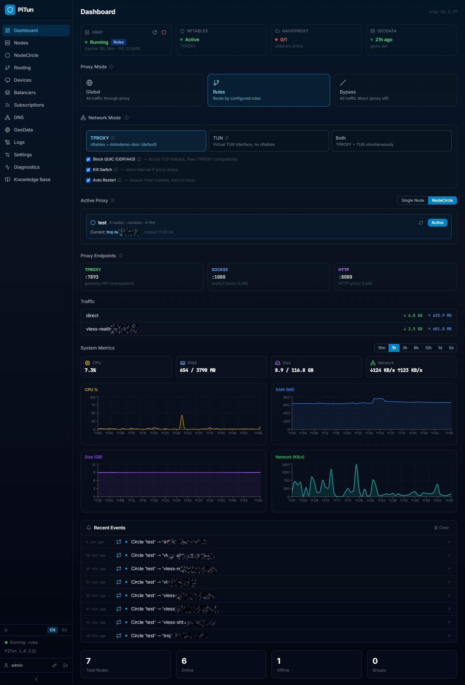
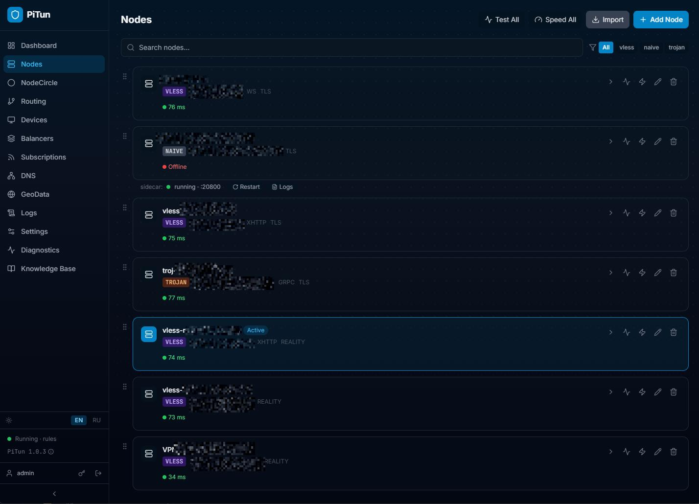
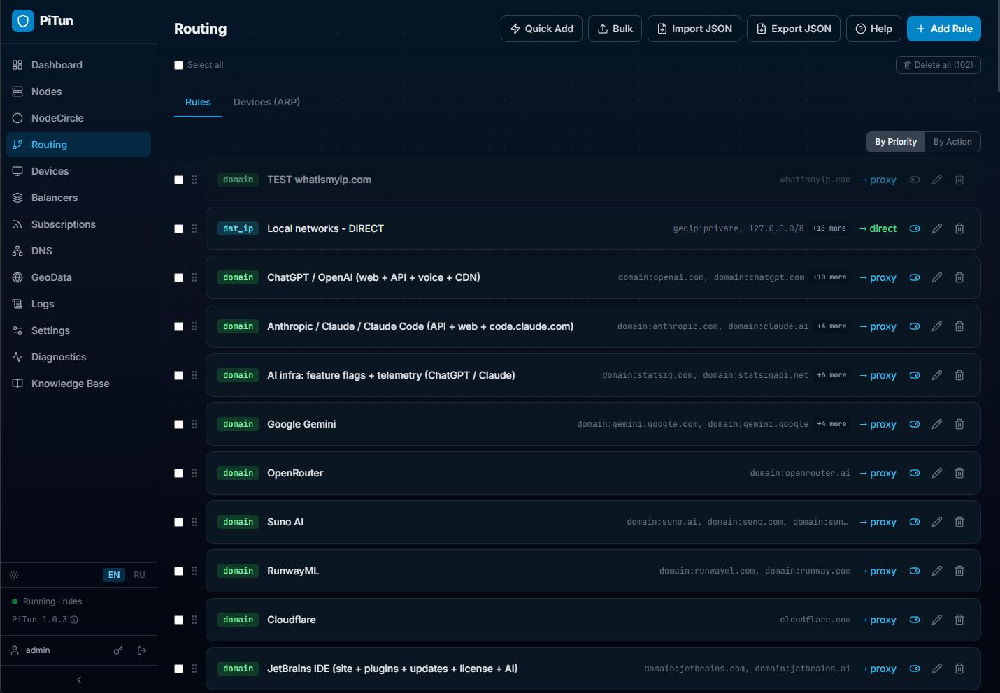
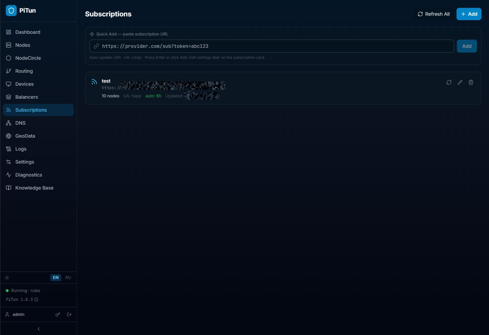
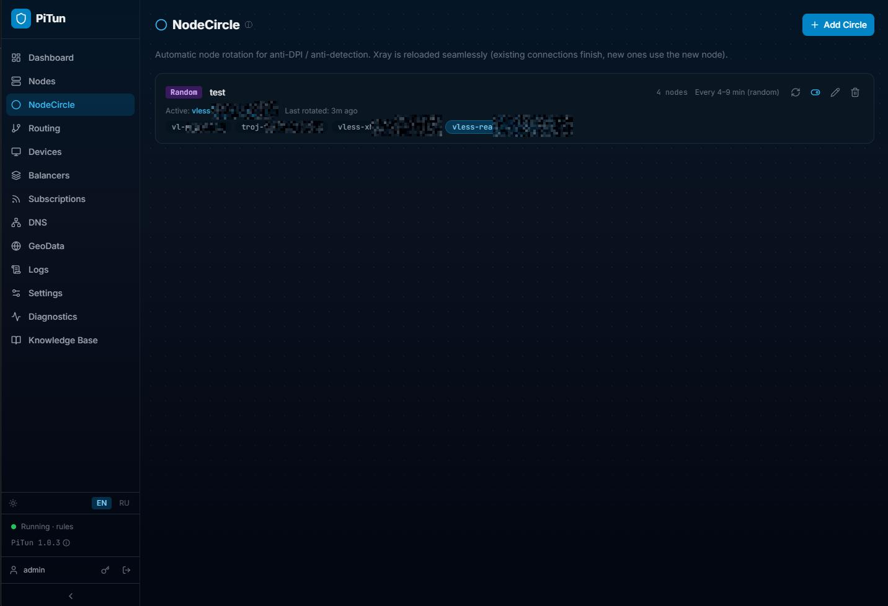
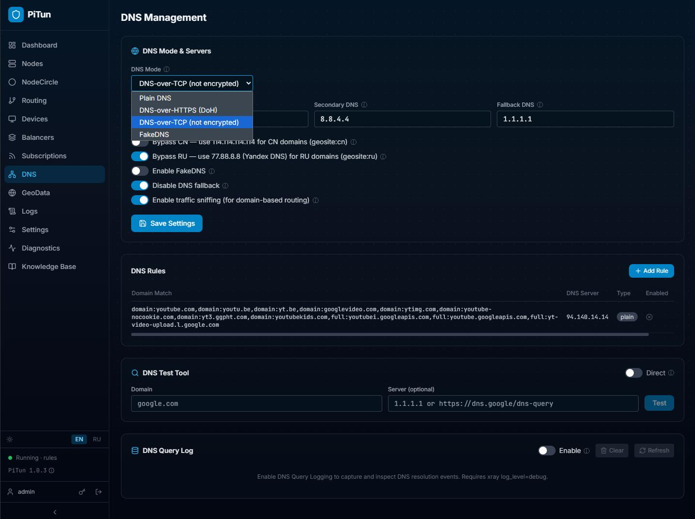
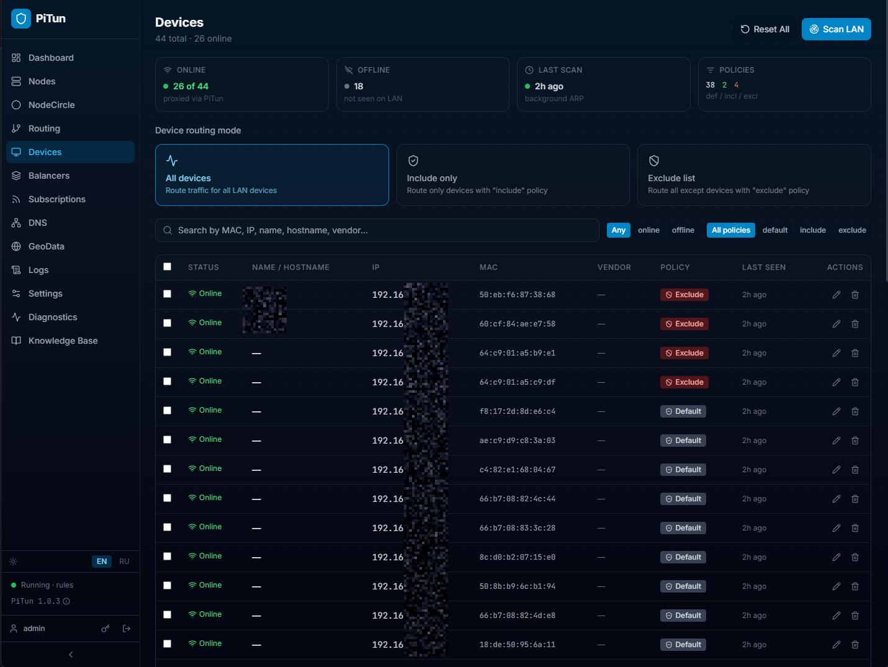
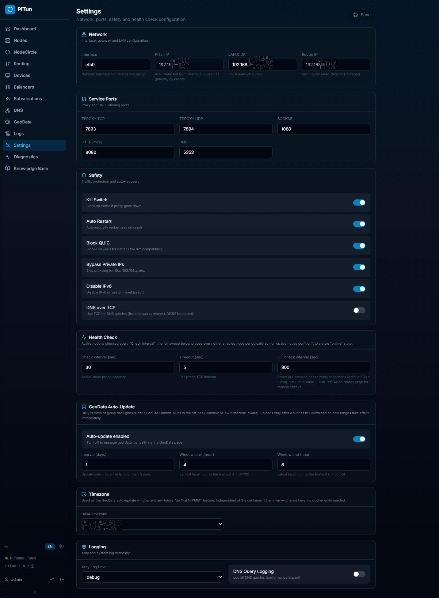

# PiTun

**🌐 Languages:** **English** · [Русский](README.ru.md)

> Self-hosted transparent proxy manager for Raspberry Pi 4/5 (and any
> other Linux box). Drops in next to your router, intercepts LAN
> traffic via nftables TPROXY, and routes it through xray-core based
> on your rules — domain, GeoIP, GeoSite, MAC, port, protocol — with a
> web UI.

[](#)
[](LICENSE)
[](#)

📸 **Screenshots:** [jump to gallery](#screenshots).

---

## Table of contents

- [What it is](#what-it-is)
- [Screenshots](#screenshots)
- [Architecture](#architecture)
- [Features](#features)
- [Supported protocols](#supported-protocols)
- [Quick start](#quick-start)
- [Configuration](#configuration)
- [Development](#development)
- [Tech stack](#tech-stack)
- [Acknowledgements](#acknowledgements)
- [Contributing](#contributing)
- [License](#license)

---

## What it is

PiTun turns a small Linux box into a **transparent proxy gateway** for
your home network. Devices that use the box as their default gateway
have their outbound traffic intercepted at the kernel level, routed
through one of several supported VPN protocols, and either tunnelled,
sent direct, or dropped — all according to rules you set up in the
web UI.

It was built for and primarily tested on the **Raspberry Pi 4 / 5**
(64-bit Raspberry Pi OS), but the project ships **linux/amd64** images
too, so any Intel/AMD mini-PC, NUC, old laptop or x86_64 server that
can run Docker works just as well. Multi-arch images for both
`linux/arm64` and `linux/amd64` are produced by the
[release workflow](.github/workflows/release.yml).

It's designed for the case where you want a single shared exit policy
for the whole house (TVs, phones, IoT) without installing a client app
on every device, and without depending on cloud-managed routers.

**Three proxy endpoints exposed simultaneously, all sharing the same
routing rule set:**

| Endpoint | Default port | Use case |
|---|---|---|
| TPROXY | `7893` | Transparent gateway — devices set the box as gateway |
| SOCKS5 | `1080` | Explicit proxy for browsers and apps |
| HTTP | `8080` | For apps without SOCKS5 support |

## Screenshots

<a href="docs/screenshots/dashboard.jpg">
  
</a>

<table>
  <tr>
    <td width="50%">
      <a href="docs/screenshots/nodes.jpg"></a>
      <p align="center"><sub><b>Nodes</b> — protocols, transports, latency, sidecar status</sub></p>
    </td>
    <td width="50%">
      <a href="docs/screenshots/routing.jpg"></a>
      <p align="center"><sub><b>Routing</b> — drag-priority rules, bulk import, V2RayN/Shadowrocket round-trip</sub></p>
    </td>
  </tr>
  <tr>
    <td width="50%">
      <a href="docs/screenshots/subscription.jpg"></a>
      <p align="center"><sub><b>Subscriptions</b> — auto-update, per-OS Happ presets, custom UA override</sub></p>
    </td>
    <td width="50%">
      <a href="docs/screenshots/circles.jpg"></a>
      <p align="center"><sub><b>Node Circles</b> — seamless rotation via xray gRPC API</sub></p>
    </td>
  </tr>
  <tr>
    <td width="50%">
      <a href="docs/screenshots/dns.jpg"></a>
      <p align="center"><sub><b>DNS</b> — per-domain rules, FakeDNS pool, query log + stats</sub></p>
    </td>
    <td width="50%">
      <a href="docs/screenshots/devices.jpg"></a>
      <p align="center"><sub><b>Devices</b> — LAN discovery, OUI vendors, per-device routing policy</sub></p>
    </td>
  </tr>
  <tr>
    <td colspan="2" width="100%">
      <a href="docs/screenshots/settings.jpg"></a>
      <p align="center"><sub><b>Settings</b> — TPROXY / TUN / DNS / health check / GeoData scheduler / kill switch</sub></p>
    </td>
  </tr>
</table>

## Architecture

```
                 ┌──────────────────────────────────────────────┐
  Devices  ────► │  PiTun host (RPi / mini-PC)                  │
  (LAN)          │                                              │
                 │  nftables TPROXY :7893                       │
                 │       │                                      │
                 │       ▼                                      │
                 │  xray-core ─┬─ rules (geoip / geosite /      │
                 │             │   domain / IP / MAC / port)    │
                 │             │                                │
                 │             ├─► proxy   (VPN node / chain)   │
                 │             ├─► direct  (home router)        │
                 │             └─► block                        │
                 │                                              │
                 │  + balancer groups (leastPing / random)      │
                 │  + node circles (auto-rotate active node)    │
                 │  + per-domain DNS (plain / DoH / DoT)        │
                 └──────────────────────────────────────────────┘
```

Web UI talks to a FastAPI backend that owns the xray-core process,
the nftables ruleset, and a SQLite database with all configuration.
Frontend is a single-page React app served by nginx.

## Features

**Core**
- Transparent proxy via TPROXY + nftables, no per-device client
- SOCKS5 / HTTP proxies on the LAN
- Optional TUN mode and combined TPROXY+TUN
- QUIC (UDP/443) blocking — forces TCP fallback for protocols TPROXY
  can intercept
- Tunnel chaining — VLESS-inside-WireGuard, etc.
- Kill switch — drop all forwarded traffic if xray crashes

**Routing**
- Rule types: `mac`, `src_ip`, `dst_ip`, `domain`, `port`, `protocol`,
  `geoip`, `geosite`
- Actions: `proxy`, `direct`, `block`, `node:<id>`, `balancer:<id>`
- Drag-and-drop priority, bulk import, V2RayN/Shadowrocket JSON
  round-trip
- Per-MAC overrides ("this device always direct, that one always
  through node #5")

**Health & resilience**
- Background liveness probe with auto-failover to a fallback node
- Speed test per node via short-lived isolated xray instance
- Naive sidecar supervisor — auto-restarts crashed Naive containers
  with a sliding-window rate limiter
- Recent Events feed on Dashboard surfaces failovers, sidecar
  restarts, geo updates, circle rotations

**Balancing & rotation**
- Balancer groups (xray's `leastPing` or `random` strategies)
- Node Circles — automatically rotate the active node on a schedule,
  seamlessly via xray's gRPC API (no dropped connections)

**Subscriptions**
- Periodic refresh from VLESS / VMess / Trojan / SS / Hysteria2 /
  Clash YAML / xray JSON subscription URLs
- Per-subscription User-Agent (v2ray, clash, sing-box, happ, …),
  optional regex filter, configurable interval

**Devices & DNS**
- LAN discovery via `arp-scan`, OUI vendor lookup
- Per-device routing policy (default / always-include / always-bypass)
- Per-domain DNS rules (plain, DoH, DoT)
- FakeDNS pool for sniffing-friendly geoip resolution
- DNS query log with stats

**Operations**
- One-click GeoIP / GeoSite refresh from Loyalsoldier's dataset
- Built-in diagnostics page (DNS reachability, gateway, xray status,
  resource usage)
- Streaming xray log viewer
- Multi-language UI (English / Russian)

## Supported protocols

| Protocol | Notes |
|---|---|
| **VLESS** | Plain, TLS, REALITY, XTLS Vision, with WebSocket / gRPC / xhttp / HTTP/2 / HTTPUpgrade / mKCP / QUIC transports |
| **VMess** | Same transport menu as VLESS |
| **Trojan** | TLS / WebSocket / gRPC / xhttp |
| **Shadowsocks** | All modern stream / AEAD ciphers |
| **WireGuard** | Native xray outbound; works inside chains |
| **Hysteria2** | UDP, with optional obfuscation password |
| **SOCKS5** | As outbound (e.g. for chaining) |
| **NaiveProxy** | Per-node sidecar container (Caddy + forwardproxy on the server side); xray connects via local SOCKS5 |

## Quick start

### System requirements

| Resource | Minimum | Recommended |
|---|---|---|
| **CPU** | 64-bit ARM (RPi 4) or x86_64, 4 cores | RPi 5 / any modern x86_64 mini-PC |
| **RAM** | 1 GB | 2 GB+ (helps with naive sidecars and large geo data refresh) |
| **Disk** | 4 GB free | 8 GB+ (docker images + DB growth + DNS query log) |
| **Network** | 1 LAN interface, static IP, wired preferred | 1× wired GbE for LAN |
| **OS** | Any modern 64-bit Linux with kernel ≥ 5.4 (TPROXY support) | Raspberry Pi OS 64-bit, Debian 12+, Ubuntu 22.04+ |
| **Architectures** | `linux/arm64` *(RPi 4/5)* · `linux/amd64` *(Intel/AMD mini-PC, NUC, x86_64 server)* | — |

### Prerequisites

- One of the supported architectures above
- Docker + Docker Compose v2
- Root access on the host (nftables + raw socket binding)
- A static LAN IP for the host

### Install — one-liner

The simplest install is a single command that downloads everything,
prepares the host, and brings up the stack. It pulls pre-built images
from the latest GitHub Release, so no Docker build runs locally —
total time is ~5 minutes on a fresh RPi, and the install resumes
cleanly if the connection drops mid-way (every download is retried
and atomically renamed).

```bash
curl -fsSL https://raw.githubusercontent.com/DaveBugg/PiTun/master/install.sh | sudo bash
```

Useful flags (after `bash -s --`):

```bash
# Pin a specific version
... | sudo bash -s -- --version v1.0.5

# Force rebuilding from source (no published release available, or
# you're testing local changes). Slower, needs reliable internet
# during the docker build.
... | sudo bash -s -- --build

# Air-gapped install — point at a directory containing pre-downloaded
# artifacts (pitun-{backend,naive,frontend}-vX.Y.Z-<arch>.tar.gz +
# pitun-src.tar.gz + xray.zip + geoip.dat + geosite.dat).
... | sudo bash -s -- --offline /tmp/pitun-artifacts

# Custom install path (default: /opt/pitun)
... | sudo bash -s -- --dir /srv/pitun

# Just preview what it would do — no changes made
... | sudo bash -s -- --dry-run
```

After the script finishes:
- Web UI is at `http://<this-host-ip>/`, login `admin` / `admin`
  (**change it on first login** via *Settings → Account*).
- `/opt/pitun/.env` was generated with a random `SECRET_KEY` and your
  default LAN interface autodetected. Edit it to set `LAN_CIDR` /
  `GATEWAY_IP` matching your network, then `docker compose -f
  /opt/pitun/docker-compose.yml restart`.

> See [`install.sh --help`](install.sh) for the full option list.

### Install — git clone path

If you want the source tree alongside the running stack (e.g. for
development, or to apply patches before deploy), the classic path
still works:

```bash
git clone https://github.com/DaveBugg/PiTun pitun
cd pitun

# Host bootstrap: installs Docker (if missing), xray-core, GeoIP/GeoSite,
# system packages, kernel modules, sysctl tweaks, log rotation, daily
# cleanup cron. Skip if you'd rather do it manually — see "Manual install"
# below.
sudo bash scripts/setup.sh

cp .env.example .env
# Edit .env — at minimum set SECRET_KEY, INTERFACE, LAN_CIDR, GATEWAY_IP.
# A random SECRET_KEY: openssl rand -hex 32

docker compose up -d --build
```

The web UI listens on the host's LAN IP, port 80. Default login is
`admin` / `admin` — **change it on first run** via *Settings → Account*.

### Manual install (without `setup.sh`)

If you'd rather wire the host yourself, here's the equivalent checklist.
Everything below must be done **before** `docker compose up`:

```bash
# 1. System packages
sudo apt update
sudo apt install -y curl wget ca-certificates nftables iproute2 \
    net-tools iptables arp-scan dnsutils unzip jq cron

# 2. Free UDP/5353 (PiTun's DNS port)
sudo systemctl stop avahi-daemon avahi-daemon.socket || true
sudo systemctl disable avahi-daemon avahi-daemon.socket || true
sudo systemctl mask avahi-daemon || true

# 3. Sysctl: IP forwarding + TPROXY loopback
sudo tee /etc/sysctl.d/99-pitun.conf <<'EOF'
net.ipv4.ip_forward = 1
net.ipv6.conf.all.forwarding = 1
net.ipv4.conf.all.route_localnet = 1
EOF
sudo sysctl --system

# 4. TPROXY kernel modules (load now + pin for next boot)
sudo modprobe nft_tproxy xt_TPROXY
echo -e "nft_tproxy\nxt_TPROXY" | sudo tee /etc/modules-load.d/pitun.conf

# 5. Docker + Compose v2 (skip if already installed)
curl -fsSL https://get.docker.com | sudo sh
sudo usermod -aG docker "$USER"   # then log out + back in

# 6. xray-core + GeoIP/GeoSite (bind-mounted into the backend container)
XRAY_VER="26.3.27"
case "$(uname -m)" in
  aarch64|arm64) ARCH="arm64-v8a" ;;
  x86_64)        ARCH="64" ;;
  *) echo "Unsupported arch"; exit 1 ;;
esac
curl -fsSL "https://github.com/XTLS/Xray-core/releases/download/v${XRAY_VER}/Xray-linux-${ARCH}.zip" -o /tmp/xray.zip
sudo unzip -o /tmp/xray.zip -d /usr/local/bin/ xray
sudo chmod 755 /usr/local/bin/xray
sudo mkdir -p /usr/local/share/xray
sudo curl -fsSL -o /usr/local/share/xray/geoip.dat   https://github.com/Loyalsoldier/v2ray-rules-dat/releases/latest/download/geoip.dat
sudo curl -fsSL -o /usr/local/share/xray/geosite.dat https://github.com/Loyalsoldier/v2ray-rules-dat/releases/latest/download/geosite.dat

# 7. Static IP on the LAN interface (use NetworkManager, dhcpcd, or netplan
#    depending on your distro; not scripted because the right tool varies).

# 8. Now you can deploy
cp .env.example .env && $EDITOR .env
docker compose up -d --build
```

> **Why `xray` is on the host and not in the container.** Historical:
> the original deploy was Docker-less and started xray as a systemd
> service. When it got Dockerized, the `xray` binary kept living on
> the host (bind-mounted read-only into the backend container) so
> updating xray didn't require rebuilding the image. A future change
> may roll it into the backend image to cut this step — until then,
> the bind-mount is part of the contract.

### Pre-built images

The CI release workflow publishes loadable Docker tarballs (linux/amd64
and linux/arm64) as GitHub Release assets. Useful for air-gapped /
factory-fresh RPi installs:

```bash
# On a machine with internet
curl -LO https://github.com/DaveBugg/PiTun/releases/download/vX.Y.Z/pitun-backend-vX.Y.Z-arm64.tar.gz
curl -LO https://github.com/DaveBugg/PiTun/releases/download/vX.Y.Z/pitun-frontend-vX.Y.Z.tar.gz

# Transfer to the host, then:
docker load < pitun-backend-vX.Y.Z-arm64.tar.gz
tar -xzf pitun-frontend-vX.Y.Z.tar.gz -C frontend/dist/
docker compose up -d
```

### Setup scripts

For RPi-specific bootstrap (first boot, OS-level dependencies, network
config) `scripts/` ships with helpers — see [scripts/README.md](scripts/README.md).

## Configuration

All runtime config goes through the web UI. The only settings that
must be set before first start, via `.env`:

| Variable | Default | What |
|---|---|---|
| `SECRET_KEY` | `changeme-…` | JWT signing key — `openssl rand -hex 32` |
| `INTERFACE` | `eth0` | LAN interface name on the host |
| `LAN_CIDR` | `192.168.1.0/24` | Your LAN subnet |
| `GATEWAY_IP` | `192.168.1.1` | Your home router's IP (used for `direct` traffic) |
| `BACKEND_PORT` | `8000` | Backend listen port (behind nginx) |
| `TPROXY_PORT_TCP` | `7893` | TPROXY TCP listener |
| `DNS_PORT` | `5353` | Internal DNS forwarder port |
| `NAIVE_PORT_RANGE_START` | `20800` | Allocator range for naive sidecars |
| `NAIVE_IMAGE` | `pitun-naive:latest` | Image tag built locally or loaded from release |

Full annotated example: [`.env.example`](.env.example).

## Development

```bash
# Backend
cd backend
python -m venv .venv && source .venv/bin/activate
pip install -r requirements.txt -r requirements-dev.txt
python -m uvicorn app.main:app --reload --port 8000
python -m pytest tests/ -q

# Frontend
cd frontend
npm ci
npm run dev          # http://localhost:5173
npm run build        # tsc + vite (catches type errors)
npm run test:ci
npm run lint
```

The full Docker stack lives in `docker-compose.yml`. For local UI work
without RPi-specific bits (TPROXY, nftables) you can skip Docker — auth,
nodes, routing rules and most of the UI work fine on macOS/Windows
against a backend running on `localhost:8000`.

See [`CONTRIBUTING.md`](CONTRIBUTING.md) for PR conventions and code
style.

## Tech stack

**Backend** — Python 3.11, FastAPI, SQLModel/SQLAlchemy, Alembic,
Pydantic v2, Uvicorn, httpx, aiohttp, aiosqlite, bcrypt, python-jose,
psutil, docker-py, PyYAML.

**Frontend** — React 19, TypeScript, Vite, Tailwind CSS 3, TanStack
Query (React Query) v5, Zustand, React Router 6, Recharts, Lucide
React, axios, clsx, tailwind-merge.

**Infrastructure** — Docker + Compose, nginx (frontend), Tecnativa's
docker-socket-proxy (read-only Docker API access from the backend),
nftables, systemd.

**Testing** — pytest, Vitest, Testing Library.

## Acknowledgements

PiTun is glue code on top of mature, hard-to-replicate upstream
projects. Without them, none of this would exist:

### Proxy / network core

- **[XTLS/Xray-core](https://github.com/XTLS/Xray-core)** — the actual
  proxy engine. PiTun manages an xray-core process, generates its
  config, and talks to its gRPC API.
- **[klzgrad/naiveproxy](https://github.com/klzgrad/naiveproxy)** —
  Chromium-based HTTPS-tunnelling proxy used as a per-node sidecar.
  PiTun's `docker/naive/` builds an image from upstream releases.
- **[Caddy](https://caddyserver.com/)** with **[caddyserver/forwardproxy](https://github.com/caddyserver/forwardproxy)**
  (klzgrad's fork) — recommended NaiveProxy server. `scripts/setup-naive-server.sh`
  builds it via [`xcaddy`](https://github.com/caddyserver/xcaddy).
- **[Loyalsoldier/v2ray-rules-dat](https://github.com/Loyalsoldier/v2ray-rules-dat)**
  — GeoIP / GeoSite rule databases used by xray's `geoip:` / `geosite:`
  matchers. PiTun pulls the latest `geoip.dat` and `geosite.dat` from
  here.
- **[MaxMind GeoLite2](https://www.maxmind.com/en/geolite2/)** —
  GeoIP-MMDB lookups (optional, opt-in).
- **[netfilter / nftables](https://www.netfilter.org/projects/nftables/)**
  — kernel-side TPROXY interception.
- **[arp-scan](https://github.com/royhills/arp-scan)** — LAN device
  discovery.

### Backend

- **[FastAPI](https://github.com/tiangolo/fastapi)** — HTTP framework
- **[SQLModel](https://github.com/tiangolo/sqlmodel)** + **[SQLAlchemy](https://www.sqlalchemy.org/)** — ORM
- **[Pydantic](https://github.com/pydantic/pydantic)** — validation
- **[Alembic](https://github.com/sqlalchemy/alembic)** — migrations
- **[Uvicorn](https://github.com/encode/uvicorn)** — ASGI server
- **[httpx](https://github.com/encode/httpx)** + **[aiohttp](https://github.com/aio-libs/aiohttp)** — HTTP clients
- **[aiosqlite](https://github.com/omnilib/aiosqlite)** — async SQLite
- **[python-jose](https://github.com/mpdavis/python-jose)** + **[bcrypt](https://github.com/pyca/bcrypt/)** — auth
- **[psutil](https://github.com/giampaolo/psutil)** — host metrics
- **[docker-py](https://github.com/docker/docker-py)** — Docker API client (Naive sidecar lifecycle)
- **[PyYAML](https://pyyaml.org/)** — Clash YAML import

### Frontend

- **[React](https://react.dev/)**, **[Vite](https://vitejs.dev/)**,
  **[TypeScript](https://www.typescriptlang.org/)**
- **[Tailwind CSS](https://tailwindcss.com/)** — styling
- **[TanStack Query](https://tanstack.com/query)** — server state
- **[Zustand](https://github.com/pmndrs/zustand)** — UI state
- **[React Router](https://reactrouter.com/)** — routing
- **[Recharts](https://recharts.org/)** — metrics charts
- **[Lucide](https://lucide.dev/)** — icons
- **[axios](https://github.com/axios/axios)** — HTTP client
- **[Vitest](https://vitest.dev/)** + **[Testing Library](https://testing-library.com/)** — tests

### Infrastructure

- **[Docker](https://www.docker.com/)** + **[Compose](https://docs.docker.com/compose/)**
- **[nginx](https://nginx.org/)** — frontend serving + WebSocket proxy
- **[Tecnativa/docker-socket-proxy](https://github.com/Tecnativa/docker-socket-proxy)**
  — locked-down Docker API access for the backend

PiTun's import format compatibility (V2RayN / Shadowrocket / Clash JSON)
is inspired by the formats of those projects — no code is borrowed.

## Contributing

Bug reports and PRs welcome. See [`CONTRIBUTING.md`](CONTRIBUTING.md)
for code style, PR conventions, and what to keep out of the repo.

## License

[BSD 3-Clause](LICENSE) © PiTun contributors

---

> **Disclaimer.** PiTun is a network management tool. You are responsible
> for complying with the laws of your jurisdiction and the terms of
> service of any upstream provider you use it with. The maintainers
> provide no warranty and accept no liability for misuse.
